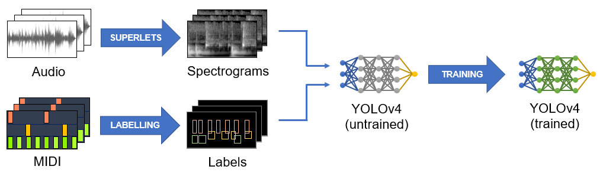
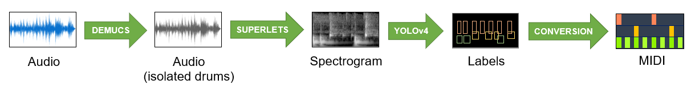
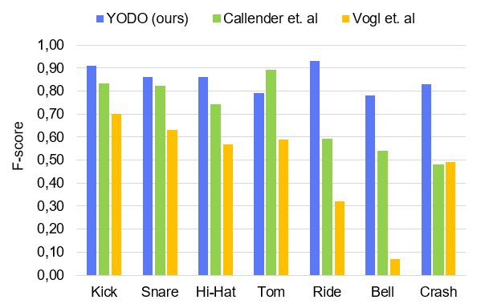

# YODO - You Only Drum Once

YODO is an Automatic Drum Transcription (ADT) system, designed to transform audio recordings of drums into musical notation, specifically as a MIDI file.

## How does it work?

YODO uses Convolutional Neural Networks (CNN), a Deep Learning technique which specializes in learning from images. More specifically, we trained the YOLOv4 object detector to detect and classify different sounds produced by drums. Since YOLOv4 needs images as an input, we first transform the audio data into spectrograms (time-frequency plots) which are then fed to the neural network.

After YOLOv4 has predicted the approximate location of each sound and identified the percussion instrument that produced it, we use a manually designed system to predict each sound's onset time and velocity. Knowing these parameters, we can easily represent the data as a MIDI file.

Additional details can be found in [our paper](TO-BE-ADDED).

## Which percussion instruments does it recognize?

YODO can detect up to 11 types of sounds, all produced by conventional drumkits:

- Kick
- Snare
- Cross Stick
- High Tom
- Mid Tom
- Low Tom
- Closed Hi-Hat
- Open Hi-Hat
- Crash Cymbal
- Ride Cymbal
- Ride Bell

That said, additional percussion instruments might be detected by the system. For example, a shaker or a maraca might be mistakenly detected as a closed hi-hat, as these instruments produce similar enough sounds. However, these is more a reflection of the system's imperfections rather than a deliberate feature.

## How accurate is it?

YODO has shown better results than previous ADT methods. If we merge some of our 11 classes into a more general 7-class system, we can compare YODO to the systems made by [Callender et. al](https://arxiv.org/abs/2004.00188) and [Vogl et. al](https://arxiv.org/abs/1806.06676):

As you can see, YODO outperforms both systems for almost every instrument, toms being the only exception. For more detailed info on YODO's performance, you can read [our paper](TO-BE-ADDED).

## How do I use it?

We have published our system as a Colab notebook, which uses Google's infrastructure to make the necessary computations. This way, you don't need a powerful computer to be able to use YODO.

[You can find the Colab notebook here](https://colab.research.google.com/drive/1mizpQMFhZUfrBOC5okmJ_1b81Ota6001?usp=sharing).

## How did you train your model?

We used a modified version of the [Extended Groove MIDI Dataset](https://magenta.tensorflow.org/datasets/e-gmd). Since we needed to transform each audio into an image, we used the [Superlet transform](https://www.nature.com/articles/s41467-020-20539-9) to generate a spectrogram for every entry in E-GMD. After that, we split these into 1024x128 images, using right padding when necessary. The resulting dataset consists of 199 236 spectrograms, each with a corresponding text file which contains the labels used to train our YOLO model.

[You can download the dataset here](https://drive.google.com/file/d/1ablgIlP8jpF03TYV1a1-FeesYek_fmWI/view?usp=sharing).

## Known issues

YODO was trained with isolated drum tracks, which were produced with an electric drumkit and have no audio processing (reverb, equalization, compression, etc).
As most recorded music has some degree of post-processing applied, YODO's performance will likely suffer from it.

We have personally found that the snare is specially affected by this, since it's very common to add reverb to it in the mixing process, which muddies the final transcription.

## Special thanks

Our work would have been impossible without the help of many people. Therefore, we give special thanks to:

- Bochkovskiy et. al for developing the [YOLOv4 object detector](https://arxiv.org/abs/2004.10934), which is an integral part of our system.
- Callender et. al for providing the [Extended Groove MIDI Dataset](https://magenta.tensorflow.org/datasets/e-gmd), which allowed us to train our model.
- Moca et. al for developing the [Superlet transform](https://www.nature.com/articles/s41467-020-20539-9), which allowed us to create better spectrograms.
- Defossez et. al for creating the [Demucs music source separator](https://github.com/facebookresearch/demucs), which allowed us to isolate drum tracks.
- [NLHPC](https://www.nlhpc.cl) for providing the necessary computational resources to train our system.

## License
YODO is released under the MIT license as found in the [LICENSE](LICENSE) file.
